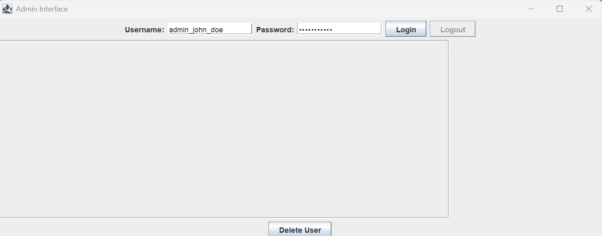

# 🌿 NZ Discovery

A multifunctional blog platform designed to share journeys and stories of exploring New Zealand. It features user registration, login, post creation, comments, likes, and a separate admin dashboard for user management.

## 🎥 Demo Preview

### User Interface (Frontend Demo)


### Admin Dashboard (Java GUI Demo)



---

## 🖥 Frontend

- Svelte
- JavaScript
- HTML
- CSS

## 🔧 Backend

- Node.js
- Express
- SQLite (via `sqlite3`)

## 📦 Java Admin Client

- Java Swing GUI
- HTTP Client (`java.net.http.HttpClient`)
- JSON parsing (`Jackson`)
- Communicates with backend API for login and user management

---

### 🖥️ Java Admin Client

#### Run All Services

```bash
# Start backend
cd backend
npm install
npm start
# Server runs at: http://localhost:3000/

# Start frontend
cd ../frontend
npm install
npm run dev
# App runs at: http://localhost:5173/

# Run Java Admin Client
cd ../java-client
javac -cp lib/* src/pccit/finalproject/javaclient/AdminInterface.java
java -cp "src:lib/*" pccit.finalproject.javaclient.AdminInterface


